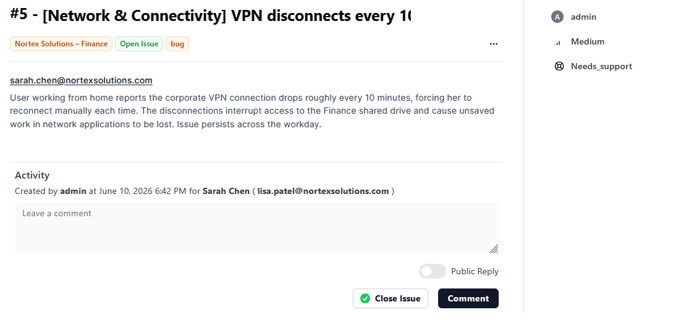

# Ticket #5 – VPN Disconnecting Every 10 Minutes

**Reported by:** Sarah Chen – Finance **Priority:** High **Category:** Network & Connectivity **Status:** Closed

#### Issue

A user working from home reported that her corporate VPN connection dropped roughly every 10 minutes, forcing her to manually reconnect each time. The disconnections interrupted access to the Finance shared drive and caused unsaved work in network applications to be lost. The issue persisted throughout the workday.

<figure><figcaption></figcaption></figure>

#### Troubleshooting & Resolution

The investigation began on the server side. The VPN server logs confirmed repeated session drops matching the interval the user reported, but no other remote users were experiencing disconnections and the VPN concentrator was healthy — which shifted suspicion to the user's local environment. The user was asked to run a continuous ping to the VPN gateway, which revealed packet loss spikes every few minutes. Her laptop was connected over Wi-Fi with weak signal strength, and the brief interference drops were exceeding the VPN client's keepalive timeout, terminating the session. As a test, the user connected directly to her router via Ethernet, and the VPN session remained stable for over an hour — confirming the root cause. The VPN client's keepalive settings were adjusted to better tolerate brief interruptions, and the user was advised to use a wired connection when possible. A follow-up at end of day confirmed no further disconnections.

**Step-by-step resolution summary**

1. Reviewed VPN server logs — confirmed repeated session drops for the user.
2. Ruled out server-side causes — no other users affected, VPN concentrator healthy.
3. Had the user run a continuous ping to the VPN gateway — observed recurring packet loss spikes.
4. Identified weak Wi-Fi signal as the cause of drops exceeding the keepalive timeout.
5. Tested a wired Ethernet connection — VPN remained stable for 60+ minutes, confirming root cause.
6. Adjusted VPN client keepalive settings to tolerate brief interruptions.
7. Advised the user on remote connectivity best practices and confirmed no recurrence at end of day.
